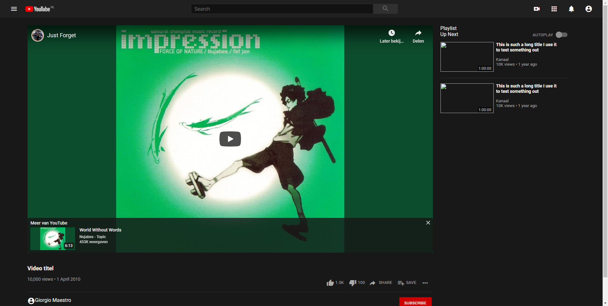
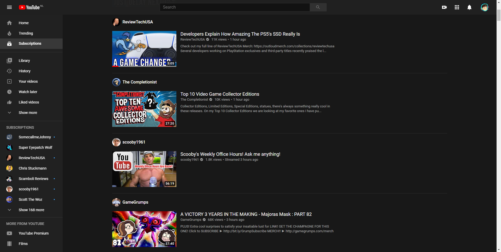
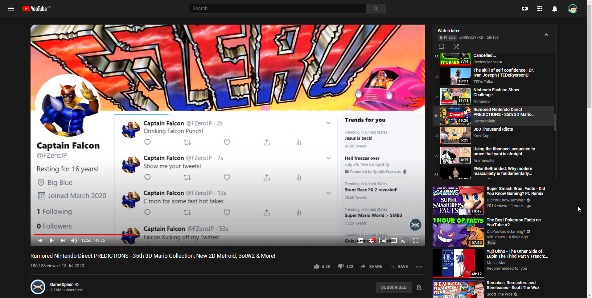
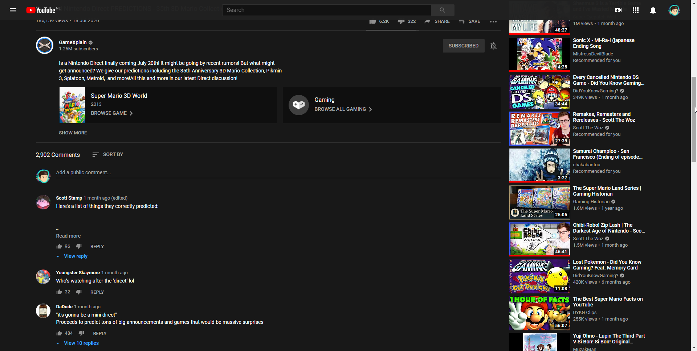

# Procesverslag
**Auteur:** Joris Meester

Markdown cheat cheet: [Hulp bij het schrijven van Markdown](https://github.com/adam-p/markdown-here/wiki/Markdown-Cheatsheet). Nb. de standaardstructuur en de spartaanse opmaak zijn helemaal prima. Het gaat om de inhoud van je procesverslag. Besteedt de tijd voor pracht en praal aan je website.

## Bronnenlijst
1. Geëmbedde YouTube video op mijn website: https://www.youtube.com/watch?v=54_tiHj2x2w
2. Roboto font: https://fonts.google.com/specimen/Roboto
3. Material icons: https://material.io/resources/icons/?style=baseline

## Eindgesprek (week 7/8)

-dit ging goed & dit was lastig-

**Screenshot(s):**

-screenshot(s) van je eindresultaat-

## Voortgang 3 (week 6)

-same as voortgang 1-

## Voortgang 2 (week 5)

-same as voortgang 1-

## Voortgang 1 (week 3)

 Stand van zaken

#### Wat goed ging:

+ Het gaat nu goed met de progressie

#### Wat minder ging:

- begon wat traag doordat ik weer even moest wennen aan CSS
- Zat lang vast met Roboto van Google Fonts importeren
- Bepaalde afmetingen zijn nog niet identiek en worstel daar het meeste mee

**Screenshot(s):**

### Agenda voor meeting

-samen met je groepje opstellen-

### Verslag van meeting

-na afloop snel uitkomsten vastleggen-

## Intake (week 1)

**Je startniveau:** rood

**Je focus:** surface

**Je opdracht:** https://youtube.com/ (videopagina, abonnementenpagina)

**Screenshot(s):**

**Breakdown-schets(en):**

