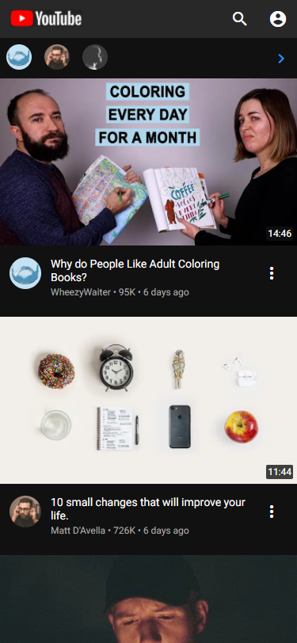
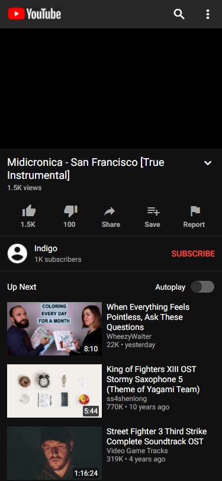
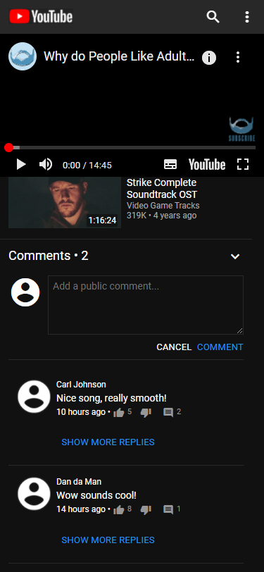
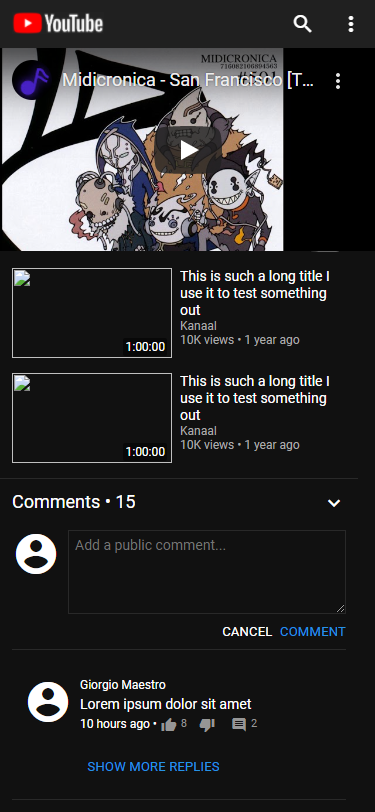

# Procesverslag
**Auteur:** Joris Meester

Markdown cheat cheet: [Hulp bij het schrijven van Markdown](https://github.com/adam-p/markdown-here/wiki/Markdown-Cheatsheet). Nb. de standaardstructuur en de spartaanse opmaak zijn helemaal prima. Het gaat om de inhoud van je procesverslag. Besteedt de tijd voor pracht en praal aan je website.

## Bronnenlijst
1. Geëmbedde YouTube video op mijn website: https://www.youtube.com/watch?&v=qUVWbEFrRSQ
2. Roboto font: https://fonts.google.com/specimen/Roboto
3. Material icons: https://material.io/resources/icons/?style=baseline
4. Video info 1: https://www.youtube.com/watch?v=EEDvf6VclD4
5. Video info 2: https://www.youtube.com/watch?v=vwqpjLfmjeQ
6. Video info 3: https://www.youtube.com/watch?v=wn6rI_0QiKc

## Eindgesprek (week 7/8)

-dit ging goed & dit was lastig-

**Screenshot(s):**

## Voortgang 3 (week 6)

### Stand van zaken

#### Wat goed ging:

+ Ik heb alle html en css af van de videopagina
+ Ik ben begonnen aan een javascript functie om herhalende html content te genereren

#### Wat minder ging:

- Ik denk dat ik veel id's en classes moet gaan vervangen met nth-of-type selectors

**Screenshot(s):**

Video pagina, nu met comments

### Agenda voor meeting

- Naomi: voorbeelden van states +-10 min.
- Tim: voorbeelden van states +-10 min.
- Saphia: afbeeldingen na h1, javascript +-10 min.
- Joris: is mijn javascript code nu efficient? +-10 min.
- Martine: naar code laten kijken +-10 min.

### Verslag van meeting

- Blijkbaar wilt school dat we veel nth-of-type gebruiken om onze elementen te selecteren ipv id's en classes
- Ik snap nu wat er wordt verwacht bij de verschillende states (hover, focus, etc)
- Blijkbaar hoef ik niet losse variabelen aan te maken voor het gebruik van objecten en kan ik ze direct aanmaken in de array

## Voortgang 2 (week 5)

### Stand van zaken

#### Wat goed ging:

+ Ik heb makkelijk de website kunnen ombouwen naar mobiel

#### Wat minder ging:

- Ik ben erachter gekomen dat ik mobile first moest ontwikkelen zelfs al kies ik de Surface focus en nu moest ik mijn website ombouwen.

**Screenshot(s):**

Video pagina (moet nog de Playlist en de reacties nabouwen)

### Agenda voor meeting

- Naomi: Javascript toepassen +- 10 min.
- Tim: redused motion, animations activeren +-10 min.
- Saphia: extra uitleg Grids responsive maken, formulieren, Javascript +- 10 min.
- Joris: accordeon, loopen array videos,comments array +-10 min.

### Verslag van meeting

- Sanne vond het een goed idee om de video's en comments met javascript te genereren
- Ik snapte niet waarom mijn font-size groter was dan op YouTube als ik dezelfde hoeveelheid rem instelde, dat is ligt dus aan de root font-size die op het <html> element staat ingesteld.

## Voortgang 1 (week 3)

### Stand van zaken

#### Wat goed ging:

+ Het gaat nu goed met de progressie

#### Wat minder ging:

- Begon wat traag doordat ik weer even moest wennen aan CSS
- Zat lang vast met Roboto van Google Fonts importeren
- Bepaalde afmetingen zijn nog niet identiek en worstel daar het meeste mee

**Screenshot(s):**

Video pagina (moet nog de Playlist en de reacties nabouwen)

### Agenda voor meeting

- Ik ga een vraag stellen over herhalende elementen in html (de suggesties rechts op de videopagina) en of het slim is dat met een loop door een array te doen

### Verslag van meeting

- Ze vonden het een goed idee, maar alleen als ik zeker wist dat ik dat zelf kan. En ik denk van wel.

## Intake (week 1)

**Je startniveau:** rood

**Je focus:** surface

**Je opdracht:** https://youtube.com/ (videopagina, abonnementenpagina)

**Screenshot(s):**

**Breakdown-schets(en):**

